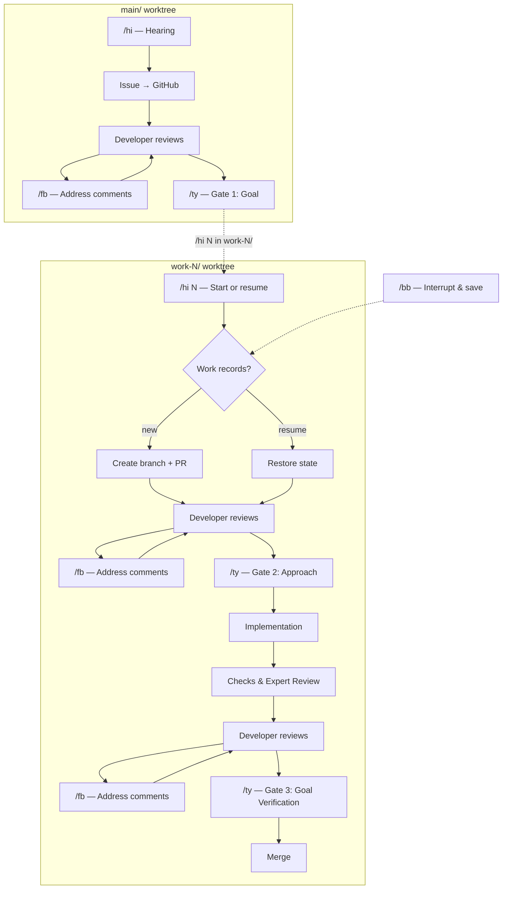

# ciya-dev

A development workflow framework for running multiple Claude Code instances in parallel using git worktrees and tmux. Each instance works on a separate issue with structured gates for goal alignment, approach review, and verification.

## Workflow



At any point, `/bb` saves progress to `.ciya/issues/nnnnn/resume.md` for later resumption.

## Usage

### First-time setup

```bash
curl -fsSL https://raw.githubusercontent.com/lovaizu/ciya-dev/main/scripts/wc.sh | bash

cd ciya-dev
vi .env    # Set GH_TOKEN and other tokens
```

### Starting worktrees and CC

```bash
./up.sh 4
# Creates work-1/ through work-4/ worktrees
# Launches tmux session "ciya" with 5 panes:
#   main/ | work-1/ | work-2/ | work-3/ | work-4/
# Each pane starts Claude Code automatically
```

### Resuming a previous session

```bash
./up.sh
# No arguments → reads saved config (or CIYA_WORK_COUNT from .env)
```

### Scaling worktrees up and down

```bash
./up.sh 6    # Adds work-5/ and work-6/
./up.sh 4    # Removes work-5/ and work-6/ (only if clean)
```

### Working on issues

In the **main/** pane:
```
/hi                    # Start hearing → brainstorm → create issue on GitHub
/fb                    # Address any issue comments
/ty                    # Gate 1: Approve the goal
```

In a **work-N/** pane:
```
/hi 42                 # Start working on issue #42
/fb                    # Address any PR comments
/ty                    # Gate 2: Approve the approach → implementation begins
                       # ... CC implements, pushes commits ...
/fb                    # Address any review comments
/ty                    # Gate 3: Verify goal achieved → squash merge
```

### Interrupting and resuming work

```
/bb                    # Saves state to .ciya/issues/nnnnn/resume.md
/hi 42                 # Later, in any work-N/: resumes where you left off
```

## Commands

| Command | Where | What it does |
|---------|-------|-------------|
| `/hi` | main/ | Start hearing → create issue |
| `/hi <issue#>` | work-N/ | Start or resume work on an issue |
| `/bb` | work-N/ | Interrupt work, save state for resumption |
| `/fb` | any | Address feedback comments on Issues or PRs |
| `/ty` | any | Approve the current gate |

## Three Gates

| Gate | Question | Where |
|------|----------|-------|
| Goal | Is the issue capturing the right problem and goal? | GitHub Issue page |
| Approach | Can the PR's approach achieve the goal? | GitHub PR page |
| Goal Verification | Has the goal been achieved? | GitHub PR page |

At each gate: review on GitHub, leave comments if needed (`/fb` to address them), then `/ty` to approve.

## Directory Structure

```
ciya-dev/
├── .bare/              Bare clone
├── .env                Environment variables (CIYA_* prefix)
├── up.sh               Symlink → main/scripts/up.sh
├── main/               Issue management worktree
│   ├── scripts/        wc.sh, up.sh
│   ├── .ciya/
│   │   └── issues/     Work records per issue
│   ├── .claude/        Commands, rules, hooks
│   └── ...
├── work-1/             Implementation worktree
├── work-2/
├── work-3/
└── work-4/
```
