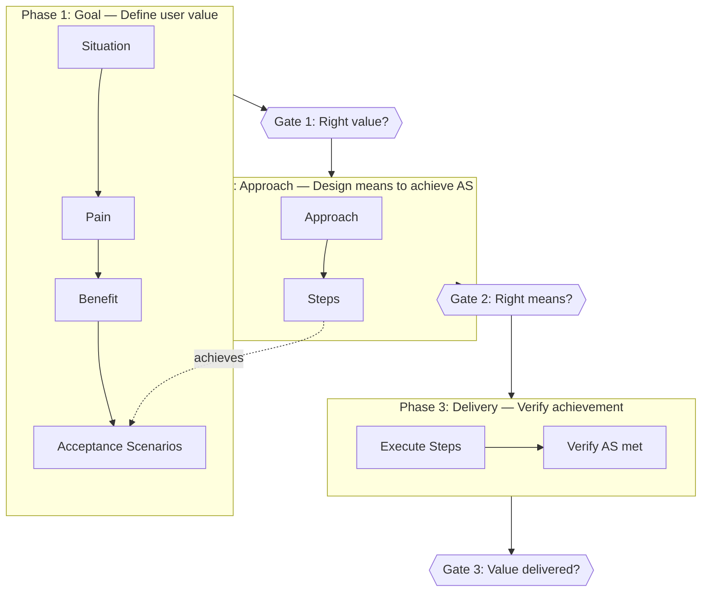
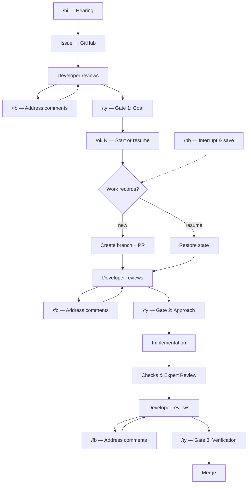

# aiya-dev

Agents in your area — multiple agent instances, right in your dev environment.

- **No babysitting** — Three gates (Goal → Approach → Verification) guard quality so you don't have to watch over every step
- **Scale as one** — Async checkpoints let you run multiple instances in parallel and multiply your throughput
- **Walk away anytime** — Save and restore work state on demand. Step away, come back, pick up where you left off

## Traceability Chain

Every element in the workflow traces back to user value. If a link is missing, the process breaks.


```mermaid
flowchart TD
    subgraph p1["Phase 1: Goal — Define user value"]
        direction LR
        S[Situation] --> P[Pain]
        P --> B[Benefit]
        B --> AS[Acceptance Scenarios]
    end
    p1 --> G1{{"Gate 1: Right value?"}}
    G1 --> p2
    subgraph p2["Phase 2: Approach — Design means to achieve AS"]
        direction LR
        A[Approach] --> T[Steps]
    end
    T -.->|achieves| AS
    p2 --> G2{{"Gate 2: Right means?"}}
    G2 --> p3
    subgraph p3["Phase 3: Delivery — Verify achievement"]
        direction LR
        EX[Execute Steps] --> V[Verify AS met]
    end
    p3 --> G3{{"Gate 3: Value delivered?"}}
```

**Issue (what):**
- **Situation** — Observable facts and circumstances
- **Pain** — Who suffers and how (the problem to solve)
- **Benefit** — Who gains what, once resolved (the value to deliver)
- **Acceptance Scenarios** — Given-When-Then scenarios that verify Benefit is achieved, grouped by target user

**PR (how):**
- **Approach** — AS-to-means mapping table: what means will achieve each AS
- **Steps** — Concrete work steps to implement each Approach, grouped by Approach

Issue-side rules:
- Every Pain must arise from the Situation. A Pain with no Situation basis is an ungrounded assumption.
- Every Benefit must trace from a Pain. A Benefit with no Pain link is solving a problem that doesn't exist.
- Every AS must connect to a Benefit. An AS with no Benefit link is measuring the wrong thing.

PR-side rules:
- Every AS must appear in the Approach table. An uncovered AS will not be achieved.
- Every Step must be grouped under its Approach. A Step unrelated to any Approach indicates a misalignment.
- Steps must fully implement the Approach they belong to.

## Phases and Gates

The workflow has three phases. Each phase has a clear purpose, and a gate where the developer reviews whether that purpose is met.

| Phase | Purpose | Gate | The developer asks |
|-------|---------|------|--------------------|
| **Goal** | Define user value | Gate 1: Goal | Do Benefit and Acceptance Scenarios capture the right user value? |
| **Approach** | Design means to achieve AS | Gate 2: Approach | Can Approach and Steps achieve all AS? |
| **Delivery** | Verify achievement | Gate 3: Verification | Are AS met and Benefits realized? |

### Goal Phase

**Purpose:** Define what user value we want to deliver.

The developer and agent identify Pain, articulate the desired Benefit, and define Acceptance Scenarios that verify the Benefit is achieved.

**Gate 1 — Goal:**
- **Relevant:** Situation, Pain, Benefit, AS — are the facts accurate, the problem real, and the measure of success right?
- **Irrelevant:** Implementation details, current architecture, technical feasibility

### Approach Phase

**Purpose:** Design the means to achieve the Acceptance Scenarios.

The agent drafts an Approach table mapping each AS to its means, then defines Steps grouped by Approach.

**Gate 2 — Approach:**
- **Relevant:** Does Approach cover all AS? Do Steps implement the Approach? Is this the optimal strategy?
- **Irrelevant:** Whether the goal itself is right (already approved at Gate 1)

### Delivery Phase

**Purpose:** Implement and verify that the goal is achieved.

The agent implements Steps, verifies AS are met, and confirms Benefits are realized.

**Gate 3 — Verification:**
- **Relevant:** Are AS met? Are Benefits realized? Does the implementation match the approved Approach?
- **Irrelevant:** Whether the approach was optimal (already approved at Gate 2)

At each gate: review on GitHub, leave comments if needed (`/fb` to address them), then `/ty` to approve.

## Quick Start

**Prerequisites:** WSL2 (Ubuntu) on Windows, Bash, and a GitHub token.

```bash
curl -fsSL https://raw.githubusercontent.com/lovaizu/aiya-dev/main/setup/wc.sh | bash

cd aiya-dev
vi .env    # Set GH_TOKEN and other tokens

./up.sh 4  # Opens 5 panes (4 workers + 1 additional)
```

## How It Works


```mermaid
flowchart TD
    H["/hi — Hearing"] --> I["Issue → GitHub"]
    I --> R1["Developer reviews"]
    R1 --> FB1["/fb — Address comments"]
    FB1 --> R1
    R1 --> G1["/ty — Gate 1: Goal"]
    G1 --> OK["/ok N — Start or resume"]
    OK --> WR{Work records?}
    WR -- new --> BR["Create branch + PR"]
    WR -- resume --> RS["Restore state"]
    BR --> R2["Developer reviews"]
    RS --> R2
    R2 --> FB2["/fb — Address comments"]
    FB2 --> R2
    R2 --> G2["/ty — Gate 2: Approach"]
    G2 --> IMPL["Implementation"]
    IMPL --> CHK["Checks & Expert Review"]
    CHK --> R3["Developer reviews"]
    R3 --> FB3["/fb — Address comments"]
    FB3 --> R3
    R3 --> G3["/ty — Gate 3: Verification"]
    G3 --> MRG["Merge"]
    BB["/bb — Interrupt & save"] -.-> WR
```

## Usage (Shell commands)

```bash
./up.sh 4              # Start 4 parallel workers
./up.sh                # Resume previous session
./dn.sh                # Stop the tmux session
```

## Commands

| Command | Full Name | What it does |
|---------|-----------|-------------|
| `wc.sh` | Welcome | First-time setup: clone, install tools, create worktrees |
| `up.sh` | Up | Start or resume a tmux session with parallel workers |
| `dn.sh` | Down | Stop the tmux session started by up.sh |
| `/hi` | Hi | Start hearing → create issue |
| `/ok <number>` | OK | Start or resume work on an issue |
| `/bb` | Bye-bye | Interrupt work, save state for resumption |
| `/fb` | Feedback | Address feedback comments on Issues or PRs |
| `/ty` | Thank you | Approve the current gate |

## Directory Structure

```
aiya-dev/
├── .bare/              Bare clone
├── .env                Environment variables (AIYA_* prefix)
├── up.sh               Symlink → main/setup/up.sh
├── dn.sh               Symlink → main/setup/dn.sh
├── main/               Worktree (default)
│   ├── setup/          wc.sh, up.sh, dn.sh
│   ├── .aiya/
│   │   └── issues/     Work records per issue
│   ├── .claude/        Commands, rules, hooks
│   └── ...
├── work-1/             Worktree
├── work-2/
├── work-3/
└── work-4/
```

## Skills

| Skill | Description |
|-------|-------------|
| skill-smith | Create, improve, evaluate, and profile Claude skills following Anthropic's Guide. Includes structural validation with PASS/FAIL/WARN grading and per-step execution profiling. |
