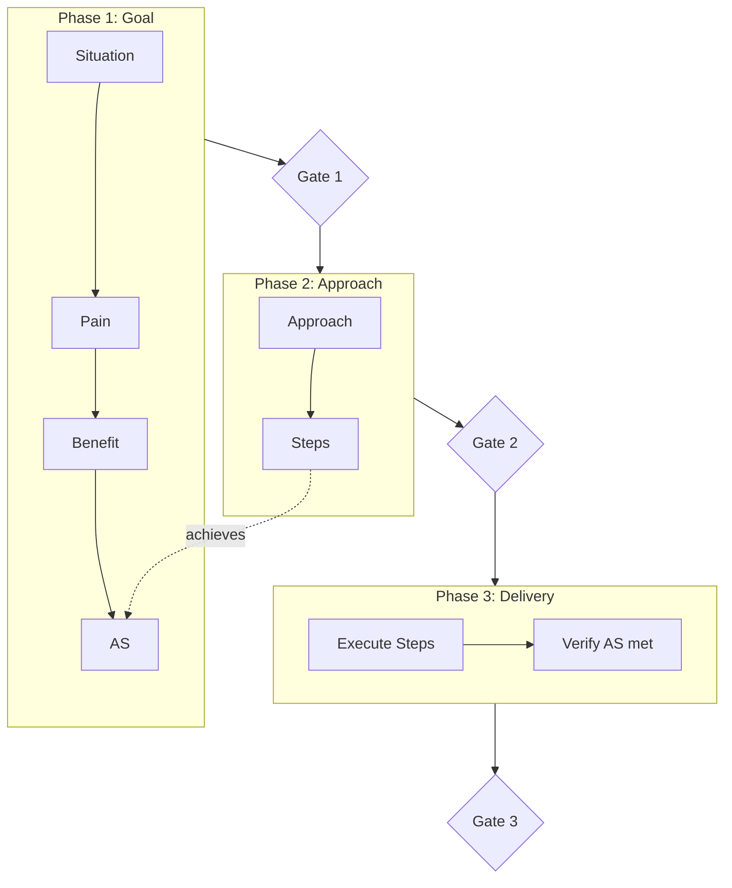
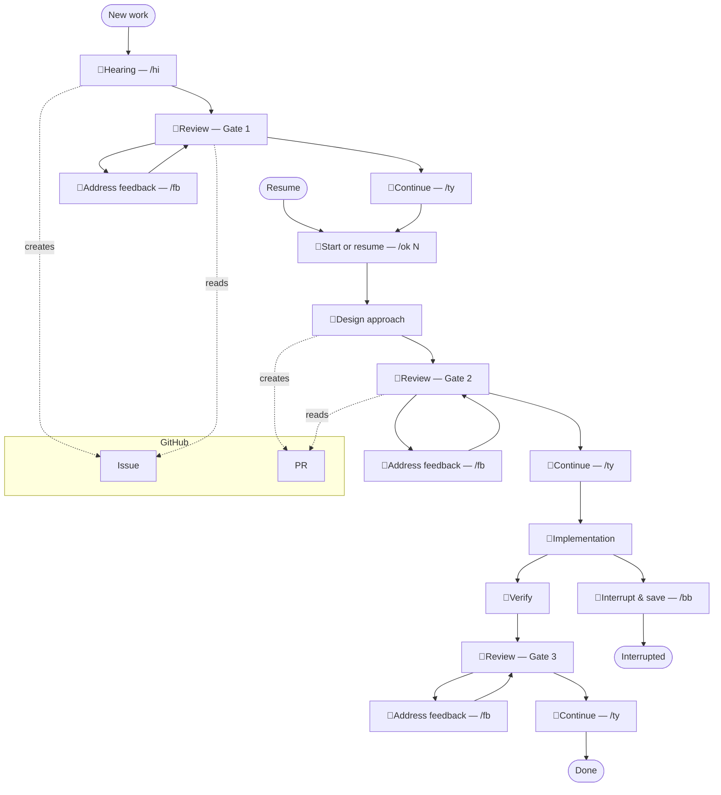

# aiya-dev

Agents in your area — multiple agent instances, right in your dev environment.

- No babysitting — Traceability chain and three gates guard quality so you don't have to watch over every step
- Scale as one — Async checkpoints let you run multiple instances in parallel and multiply your throughput
- Walk away anytime — Save and restore work state on demand. Step away, come back, pick up where you left off

## Traceability Chain

Every element in the workflow traces back to user value. Acceptance Scenarios (AS) are the measure of success. If a link is missing, the process breaks.


```mermaid
flowchart TD
    subgraph p1["Phase 1: Goal"]
        direction LR
        S[Situation] --> P[Pain]
        P --> B[Benefit]
        B --> AS[AS]
    end
    p1 --> G1{"Gate 1"}
    G1 --> p2
    subgraph p2["Phase 2: Approach"]
        direction LR
        A[Approach] --> T[Steps]
    end
    T -.->|achieves| AS
    p2 --> G2{"Gate 2"}
    G2 --> p3
    subgraph p3["Phase 3: Delivery"]
        direction LR
        EX[Execute Steps] --> V[Verify AS met]
    end
    p3 --> G3{"Gate 3"}
```

Goal-side rules:
- Every Pain must arise from the Situation. A Pain with no Situation basis is an ungrounded assumption.
- Every Benefit must trace from a Pain. A Benefit with no Pain link is solving a problem that doesn't exist.
- Every AS must connect to a Benefit. An AS with no Benefit link is measuring the wrong thing.

Approach-side rules:
- Every AS must appear in the Approach table. An uncovered AS will not be achieved.
- Every Step must be grouped under its Approach. A Step unrelated to any Approach indicates a misalignment.
- Steps must fully implement the Approach they belong to.

## Phases and Gates

| Phase | Purpose | Worker | Work | Gate | Judgment |
|-------|---------|--------|------|------|----------|
| Goal | Define user value | 🤖 | Hearing, draft issue | 👤 Gate 1 | Do Benefit and AS capture the right user value? |
| Approach | Design means to achieve AS | 🤖 | Design approach, create PR | 👤 Gate 2 | Can Approach and Steps achieve all AS? |
| Delivery | Verify achievement | 🤖 | Implement, verify | 👤 Gate 3 | Are AS met and Benefits realized? |

At each gate: review on GitHub, leave comments if needed (`/fb` to address them), then `/ty` to approve.

## Quick Start

**Prerequisites:** WSL2 (Ubuntu) on Windows, Bash, and a GitHub token.

```bash
curl -fsSL https://raw.githubusercontent.com/lovaizu/aiya-dev/main/setup/wc.sh | bash

cd aiya-dev
vi .env    # Set GH_TOKEN and other tokens

./up.sh 4  # Opens 5 panes (4 workers + 1 additional)
```

## How It Works


```mermaid
flowchart TD
    S1([New work]) --> H["🤖Hearing — /hi"]
    S2([Resume]) --> OK["🤖Start or resume — /ok N"]

    H --> R1["👤Review — Gate 1"]
    R1 --> FB1["🤖Address feedback — /fb"]
    FB1 --> R1
    R1 --> TY1["🤖Continue — /ty"]
    TY1 --> OK

    OK --> DESIGN["🤖Design approach"]
    DESIGN --> R2["👤Review — Gate 2"]
    R2 --> FB2["🤖Address feedback — /fb"]
    FB2 --> R2
    R2 --> TY2["🤖Continue — /ty"]

    TY2 --> IMPL["🤖Implementation"]
    IMPL --> CHK["🤖Verify"]
    CHK --> R3["👤Review — Gate 3"]
    R3 --> FB3["🤖Address feedback — /fb"]
    FB3 --> R3
    R3 --> TY3["🤖Continue — /ty"]
    TY3 --> DONE([Done])

    IMPL --> BB["🤖Interrupt & save — /bb"]
    BB --> STOPPED([Interrupted])

    H -.->|creates| ISSUE
    R1 -.->|reads| ISSUE
    DESIGN -.->|creates| PR_NODE
    R2 -.->|reads| PR_NODE

    subgraph GitHub
        ISSUE[Issue]
        PR_NODE[PR]
    end
```

## Usage

```bash
./up.sh 4              # Start 4 parallel workers
./up.sh                # Resume previous session
./dn.sh                # Stop the tmux session
```

## Commands

| Command | Full Name | What it does |
|---------|-----------|-------------|
| `/hi` | Hi | Start hearing → create issue |
| `/ok <number>` | OK | Start or resume work on an issue |
| `/bb` | Bye-bye | Interrupt work, save state for resumption |
| `/fb` | Feedback | Address feedback comments on Issues or PRs |
| `/ty` | Thank you | Approve the current gate |

## Directory Structure

```
aiya-dev/
├── .bare/              Bare clone
├── .env                Environment variables (AIYA_* prefix)
├── up.sh               Symlink → main/setup/up.sh
├── dn.sh               Symlink → main/setup/dn.sh
├── main/               Worktree (default)
│   ├── setup/          wc.sh, up.sh, dn.sh
│   ├── .aiya/
│   │   └── issues/     Work records per issue
│   ├── .claude/        Commands, rules, hooks
│   └── ...
├── work-1/             Worktree
├── work-2/
├── work-3/
└── work-4/
```

## Skills

| Skill | Description |
|-------|-------------|
| skill-smith | Create, improve, evaluate, and profile Claude skills following Anthropic's Guide. Includes structural validation with PASS/FAIL/WARN grading and per-step execution profiling. |
